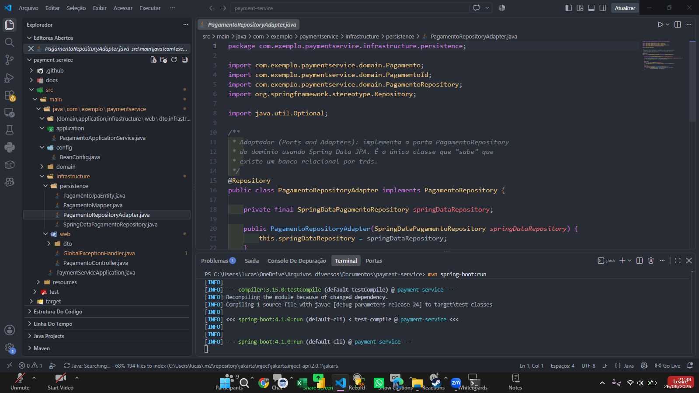
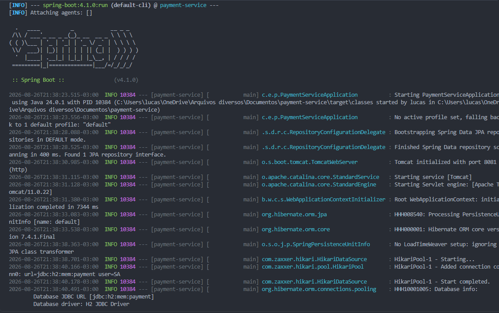
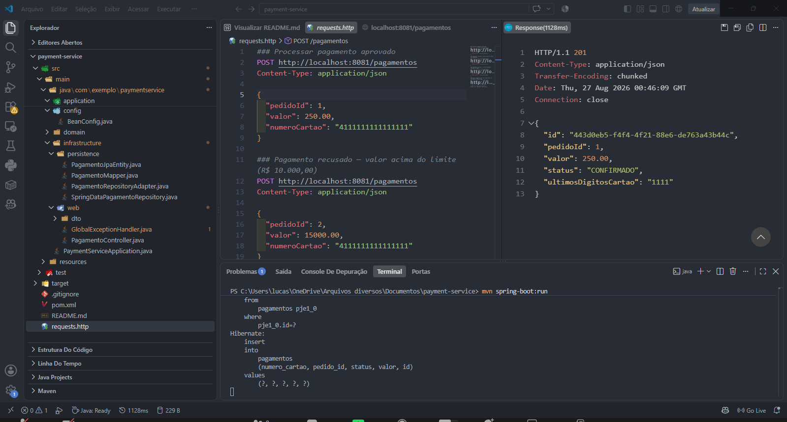
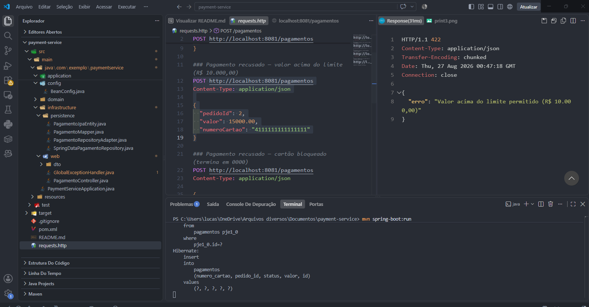
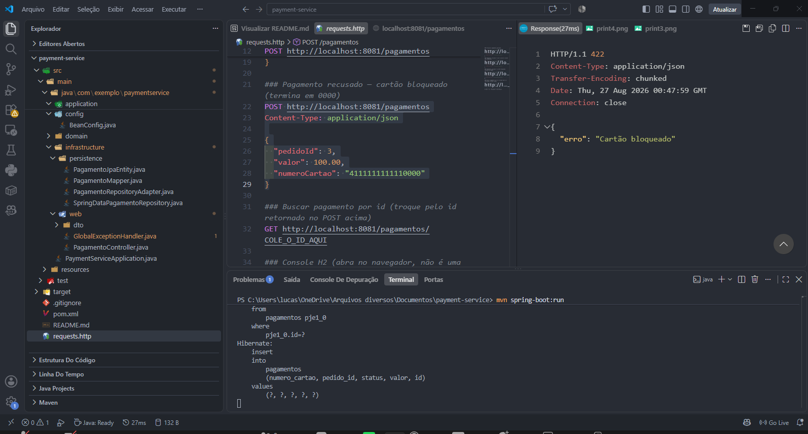
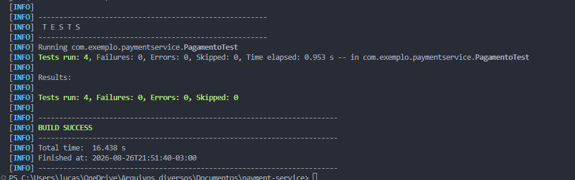
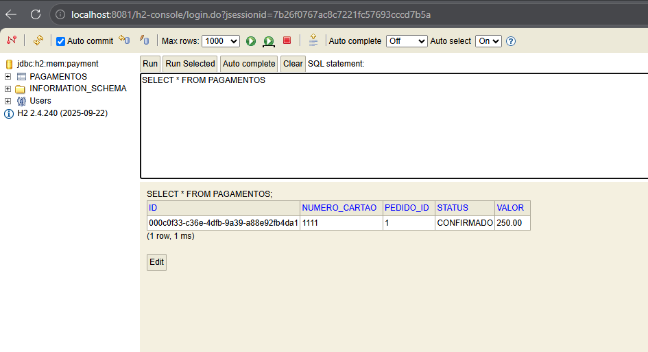
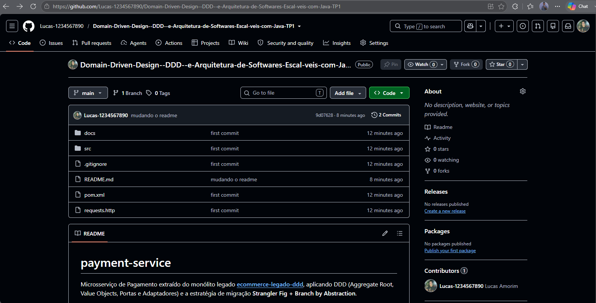

# payment-service

Microsserviço de Pagamento extraído do monólito legado **[ecommerce-legado-ddd](https://github.com/leoinfnet/ecommerce-legado-ddd)**, aplicando DDD (Aggregate Root, Value Objects, Portas e Adaptadores) e a estratégia de migração **Strangler Fig + Branch by Abstraction**.

Este projeto é o material de apoio da Questão 14 do TP1 (DDD e Arquitetura de Softwares Escaláveis com Java).

## Prints

Salve cada captura em `docs/screenshots/` com o nome exato abaixo — as imagens já estão referenciadas no README. Enquanto os arquivos não existirem, o GitHub mostra o ícone de imagem quebrada nesses pontos; é normal até você adicionar os prints.

| # | Preview | O que mostra |
|---|---|---|
| 1 |  | Estrutura de pastas do projeto aberta no VSCode |
| 2 |  | `mvn spring-boot:run` com a aplicação no ar |
| 3 |  | Pagamento aprovado (201 Created) |
| 4 |  | Pagamento recusado — valor acima do limite (422) |
| 5 |  | Pagamento recusado — cartão bloqueado (422) |
| 6 |  | `mvn test` com os 4 testes do agregado passando |
| 7 |  | Console H2 com a tabela `pagamentos` populada |
| 8 |  | Repositório publicado no GitHub |


## Tecnologias

- Java 24 (testado nessa versão; compila em qualquer JDK 21+ ajustando `java.version` no `pom.xml`)
- Spring Boot 4.1.0
- Spring Web, Spring Data JPA
- Maven
- H2 em memória

## Requisitos

- JDK 24 (ou ajuste `<java.version>` no `pom.xml` para a sua versão — rode `java -version` pra conferir)
- Maven 3.6.3 ou superior

## Estrutura do projeto

```
src/main/java/com/exemplo/paymentservice/
├── PaymentServiceApplication.java
├── domain/                        # Aggregate Root, Value Objects, porta do repositório
│   ├── Pagamento.java              (Aggregate Root)
│   ├── Valor.java                  (Value Object)
│   ├── NumeroCartao.java           (Value Object)
│   ├── PagamentoId.java / PedidoId.java
│   ├── StatusPagamento.java
│   ├── PagamentoRepository.java    (porta)
│   └── *Exception.java
├── application/
│   └── PagamentoApplicationService.java   # caso de uso, sem anotação Spring
├── config/
│   └── BeanConfig.java             # liga a application service ao container
└── infrastructure/
    ├── web/                        # controller REST + DTOs + exception handler
    └── persistence/                # entidade JPA + mapper + adaptador da porta

docs/exemplo-monolito/              # NÃO compila aqui — cole no repositório
                                     # do monólito (ver seção "Integração com o monólito")
```

O domínio (`domain/`) não importa nada de Spring nem de JPA — ele é testável isoladamente (ver `src/test`).


*Print 1 — no VSCode, com a pasta do projeto aberta, expanda `src/main/java/com/exemplo/paymentservice` até aparecerem as pastas `domain`, `application`, `config` e `infrastructure` na árvore lateral (Explorer). Essa é a foto que mostra a separação em camadas do DDD de forma visual — vale mais que qualquer parágrafo explicando.*

## Como rodar

1. Clone o repositório e abra a pasta no VSCode (extensão **Extension Pack for Java** + **Spring Boot Extension Pack** recomendadas).
2. No terminal integrado do VSCode:

```bash
mvn spring-boot:run
```

3. A API sobe em:

```
http://localhost:8081
```

4. Console H2 (opcional, pra inspecionar os dados):

```
http://localhost:8081/h2-console
JDBC URL: jdbc:h2:mem:payment
User Name: sa
Password: (em branco)
```


*Print 2 — depois de rodar `mvn spring-boot:run` no terminal integrado do VSCode, espere o log terminar e tire o print mostrando as últimas linhas, principalmente `Tomcat started on port 8081` e `Started PaymentServiceApplication in X seconds`. Deixe o terminal com fundo escuro visível — é a prova de que a aplicação subiu sem erro.*

## Testando

Use o arquivo `requests.http` (extensão **REST Client** do VSCode — clique em "Send Request" acima de cada bloco) ou `curl`:

```bash
curl -X POST http://localhost:8081/pagamentos \
  -H "Content-Type: application/json" \
  -d '{
    "pedidoId": 1,
    "valor": 250.00,
    "numeroCartao": "4111111111111111"
  }'
```


*Print 3 — envie o primeiro bloco do `requests.http` (pedido 1, valor 250, cartão terminado em 1111). Capture a resposta inteira: o status HTTP `201 Created` no topo do painel do REST Client e o corpo JSON com `"status": "CONFIRMADO"`.*

Agora os dois cenários de recusa — a parte que prova que a regra de negócio está no agregado, não decorada:

```bash
curl -X POST http://localhost:8081/pagamentos \
  -H "Content-Type: application/json" \
  -d '{"pedidoId": 2, "valor": 15000.00, "numeroCartao": "4111111111111111"}'
```


*Print 4 — envie o segundo bloco do `requests.http` (valor 15000). Capture o `422 Unprocessable Entity` com a mensagem `"erro": "Valor acima do limite permitido (R$ 10.000,00)"`.*

```bash
curl -X POST http://localhost:8081/pagamentos \
  -H "Content-Type: application/json" \
  -d '{"pedidoId": 3, "valor": 100.00, "numeroCartao": "4111111111110000"}'
```


*Print 5 — envie o terceiro bloco (cartão terminado em 0000). Capture o `422` com `"erro": "Cartão bloqueado"`.*

Também dá pra rodar os testes unitários do agregado (sem precisar da aplicação no ar):

```bash
mvn test
```


*Print 6 — rode `mvn test` num terminal separado (pode ser com a aplicação parada). Capture o resumo final do Maven: `Tests run: 4, Failures: 0, Errors: 0` e o `BUILD SUCCESS`. Essa é a prova de que a regra de negócio funciona isolada, sem precisar de HTTP nem banco no ar.*

## Regras de negócio (equivalentes às do monólito legado)

- Valor menor ou igual a zero: recusado (`Valor` não deixa instanciar).
- Valor acima de R$ 10.000,00: recusado por limite.
- Cartão terminado em `0000`: bloqueado.
- Demais cartões com valor válido: aprovados.

A diferença para o monólito é **onde** essas regras vivem: aqui elas estão dentro do Aggregate Root `Pagamento`, não espalhadas por um service — é impossível existir um `Pagamento` em memória que viole essas invariantes.


*Print 7 — com a aplicação no ar, abra `http://localhost:8081/h2-console` no navegador, cole a JDBC URL `jdbc:h2:mem:payment`, clique em Connect, e depois rode `SELECT * FROM PAGAMENTOS;` na tela de query. Capture a tabela com pelo menos os 2 registros que foram aprovados (os recusados nunca chegam a ser persistidos — ótimo detalhe pra comentar no seu TP).*

## Integração com o monólito (Strangler Fig / Branch by Abstraction)

A pasta `docs/exemplo-monolito/` contém os arquivos ilustrativos de como fica a mudança **do lado do monólito** `ecommerce-legado-ddd`, que hoje chama um `PagamentoProcessador` concreto direto no `PedidoService`:

1. `PagamentoGateway.java` — a porta que substitui a chamada direta ao processador concreto.
2. `PagamentoGatewayLegado.java` — implementação inicial, só delega pro código legado (zero risco).
3. `PagamentoGatewayRemoto.java` — implementação que chama este payment-service via HTTP, com tradução de DTO (Anti-Corruption Layer).
4. `PagamentoGatewayConfig.java` — feature flag (`pagamento.usar-novo-servico`) que decide qual implementação é usada, permitindo rollback instantâneo.

Esses arquivos **não fazem parte do build deste projeto** — copie o conteúdo deles para o repositório do monólito quando for aplicar a extração de verdade.

## Passo a passo para subir no GitHub

```bash
cd payment-service
git init
git add .
git commit -m "feat: extrai contexto de Pagamento como microsservico (DDD + Strangler Fig)"

# crie o repositório vazio no GitHub antes (via github.com/new), depois:
git branch -M main
git remote add origin https://github.com/SEU_USUARIO/payment-service.git
git push -u origin main
```


*Print 8 — depois do `git push`, abra a página do repositório no GitHub (`github.com/SEU_USUARIO/payment-service`) e capture a listagem de arquivos com o README renderizado embaixo. É o print que fecha a entrega, mostrando que o código está publicado e não só local.*

## Próximos passos possíveis (fora do escopo do TP1)

- Publicar `PagamentoConfirmadoEvent` em um broker (RabbitMQ/Kafka) em vez de o monólito chamar via HTTP síncrono, reduzindo acoplamento temporal.
- Trocar o client-generated `UUID` por um Snowflake ID se a ordenação por tempo de criação importar.
- Adicionar Testcontainers para rodar os testes de integração da camada de persistência contra um Postgres real, já que H2 em memória diverge de produção em alguns detalhes de SQL.